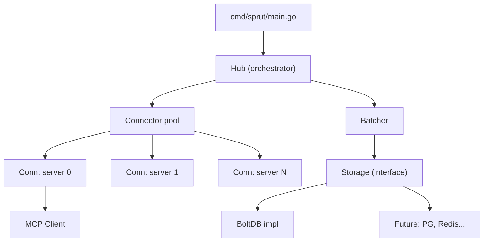
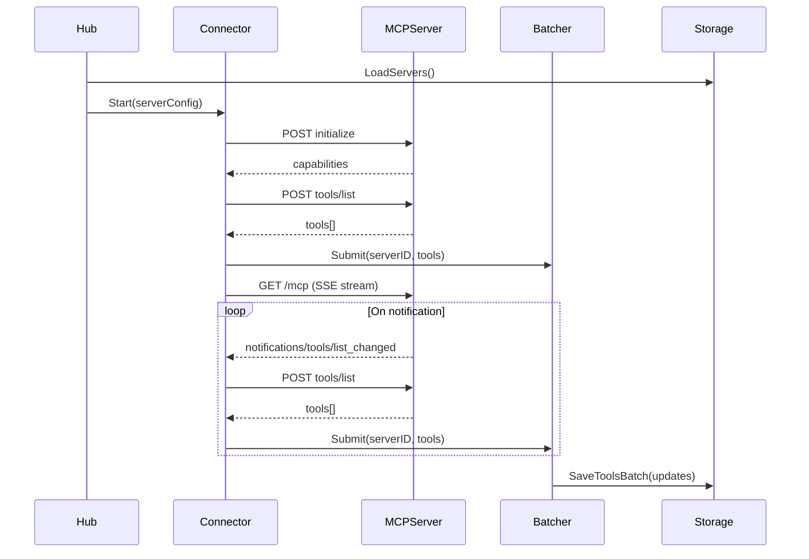

# MCPSprut

A Go service that maintains persistent SSE streams with multiple MCP (Model Context Protocol) servers, listens for tool change notifications, and stores tools in a local database via batched writes.

## Architecture



## How It Works

1. On startup, loads the list of MCP servers from storage
2. For each server, performs the MCP handshake (`initialize` + `tools/list`) and persists tools
3. Opens a GET SSE stream to each server, listening for `notifications/tools/list_changed`
4. On notification (payload is empty per MCP spec), re-fetches `tools/list` and updates storage
5. Batches writes to storage (configurable: `1` for real-time, `100` for high-throughput)
6. Detects new servers added to storage at runtime — no restart required

## Data Flow



## Project Structure

| Path | Description |
|------|-------------|
| `cmd/sprut/main.go` | Entry point, env config, graceful shutdown |
| `internal/hub/hub.go` | Orchestrator: loads servers, starts connectors, handles new servers |
| `internal/connector/connector.go` | Single MCP server connection lifecycle |
| `internal/mcpclient/client.go` | HTTP client: POST initialize, POST tools/list |
| `internal/mcpclient/stream.go` | SSE stream: GET /mcp, event parsing |
| `internal/batcher/batcher.go` | Batches tool updates, flushes by size or timer |
| `internal/storage/interface.go` | Storage interface (servers + tools) |
| `internal/storage/bolt.go` | BoltDB implementation |
| `internal/jsonrpc/schema.go` | JSON-RPC 2.0 message structs |

## Configuration

All settings are read from environment variables.

| Variable | Description | Default |
|----------|-------------|---------|
| `SPRUT_DB_PATH` | Path to BoltDB file | `sprut.db` |
| `SPRUT_BATCH_SIZE` | Batch size for tool writes | `1` |
| `SPRUT_BUFFER_SIZE` | Channel buffer between connectors and batcher | `256` |
| `SPRUT_FLUSH_INTERVAL` | Max interval between flushes | `5s` |
| `SPRUT_CONNECT_TIMEOUT` | Timeout for MCP handshake | `30s` |
| `SPRUT_RETRY_INTERVAL` | Reconnect interval on failure | `10s` |

## Graceful Shutdown

1. SIGINT/SIGTERM → cancel context
2. All Connector goroutines close SSE streams and exit
3. Batcher flushes remaining buffer
4. BoltDB closes
5. Process exits

## Graceful Degradation

Each Connector operates independently. If one MCP server goes down, the rest continue working. On SSE stream disconnect or handshake failure, the Connector waits `SPRUT_RETRY_INTERVAL` and retries.

## Running

```bash
# Start the MCP simulator (separate repo)
cd ~/golang/mcp-simulator
go run ./cmd/simulator/ --servers 10 --port 9090

# Start MCPSprut
cd ~/golang/mcp-sprut
SPRUT_DB_PATH=sprut.db go run ./cmd/sprut/
```

## Call Tree

```
main.go
├── config.Load()                              // env → Config
├── storage.NewBoltStorage(dbPath)             // open sprut.db
├── mcpclient.NewClient(timeout)               // HTTP client for MCP
├── batcher.NewBatcher(store, size, interval)
│   └── batcher.Start(ctx)                    // goroutine: buffer → flush to storage
├── hub.NewHub(store, client, batcher, retry)
│   └── hub.Start(ctx)
│       ├── store.LoadServers()                // load servers from BoltDB
│       ├── for each server → startConnector()
│       │   └── go connector.Run(ctx)          // goroutine per server
│       │       └── connect()                  // loop with retry
│       │           ├── client.Initialize()
│       │           ├── client.SendInitialized()
│       │           ├── client.ListTools() → batcher.Submit()
│       │           └── client.SubscribeNotifications() → SSE loop
│       │               └── on notification → client.ListTools() → batcher.Submit()
│       └── store.OnNewServer(callback)        // new servers at runtime
├── <-sigCh                                    // wait for SIGINT/SIGTERM
├── cancel()                                   // stop all goroutines
├── batcher.Wait()                             // wait for remaining flush
└── store.Close()                              // close BoltDB
```

## Design Patterns

| Pattern | Where |
|---------|-------|
| Repository | `Storage` interface abstracts the underlying store |
| Observer | `OnNewServer` callback for event-driven server discovery |
| Fan-out | Hub launches N Connector goroutines |
| Batch writer | Batcher accumulates updates before committing to storage |
| Graceful degradation | Individual connector failures don't bring down the system |
